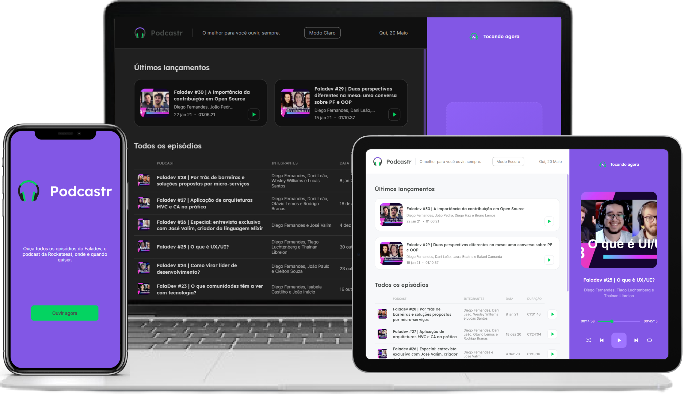

<h1 align="center">
  
</h1>

  <a href="#-tecnologias">Tecnologias</a>&nbsp;&nbsp;&nbsp;|&nbsp;&nbsp;&nbsp;
  <a href="#-projeto">Projeto</a>&nbsp;&nbsp;&nbsp;|&nbsp;&nbsp;&nbsp;
  <a href="#-layout">Layout</a>&nbsp;&nbsp;&nbsp;|&nbsp;&nbsp;&nbsp;
  <a href="#-como-executar">Como executar</a>

 

  

## 🚀 Tecnologias

Esse projeto foi desenvolvido com as seguintes tecnologias:

- [React](https://reactjs.org)
- [Next.js](https://nextjs.org/)
- [TypeScript](https://www.typescriptlang.org/)

## 💻 Projeto

<h4> Acesse em: https://nlw5-podcastr-marcelino.vercel.app </h4>

O Podcastr é um app feito para listar e reproduzir podcasts (utilizando o podcast `FalaDev` da [Rocketseat](https://github.com/rocketseat-education) como exemplo), feito durante o evento `Next Level Week 5`, da [Rocketseat](https://github.com/rocketseat-education).

## 🚀 Funcionalidades que adicionei após o evento

- Dark theme
- Landing page
- Responsividade
- Animações de loading utilizando o [Nprogress](https://ricostacruz.com/nprogress/)
- Scrollbars customizadas utilizando o [Simplebar-react](https://github.com/Grsmto/simplebar/tree/master/packages/simplebar-react)

## 🔖 Layout

Você pode visualizar o layout do projeto através [desse link](https://www.figma.com/file/XK49PlcYIA5R0dvWvALIPS/Podcastr-NLW-5). É necessário ter conta no [Figma](http://figma.com/) para acessá-lo.

## 🚀 Como executar

- Clone o repositório
- Instale as dependências com `yarn`
- Inicie o servidor com `yarn dev`

Agora você pode acessar [`localhost:5555`](http://localhost:5555) do seu navegador, logar com seu github e utilizar sua própria base de dados.

---

<h4 align="center"> Feito com ♥ por Marcelino Teixeira </h4>
